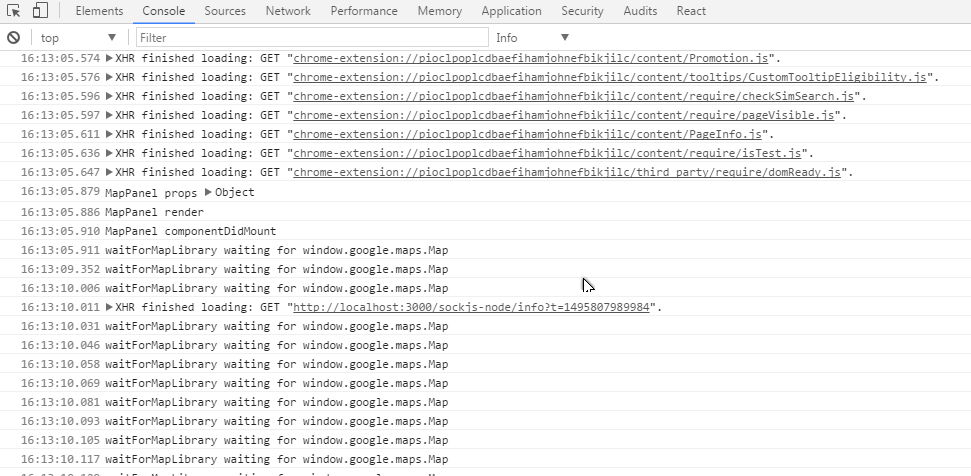
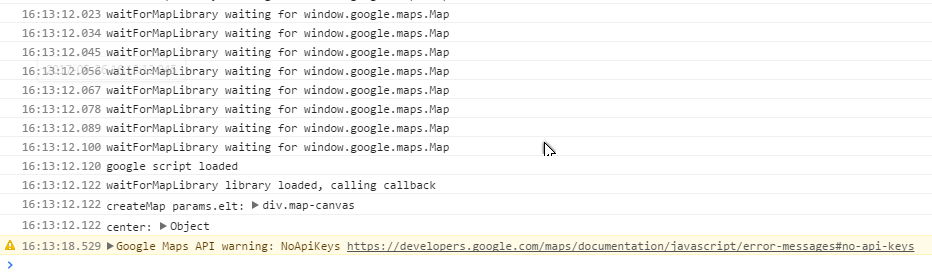

# Problem

Load and use the Google Map API Library in a React Component

# Goal of this demo:
Show a (simple?) way to load the **Google Map Javascript library** asynchronously and wait for the library to be loaded before rendering a **React component** that uses the Google Map library, without getting an exception. Alternatively, the npm google-maps-api module <https://www.npmjs.com/package/google-maps-api> can be used. It doesn't look like the official google-api-nodejs-client <https://github.com/google/google-api-nodejs-client> has the Map API, being client API running on the node.js server.

# Why:
I was trying to integrate a Google Map in a React component but kept getting an **exception** when the Google library wasn't yet ready when my React Map component was mounted/displayed. The problem is less likely to happen if your network is very fast, but very likely to happen on a smartphone with a low bandwidth.

# NOTE:
I removed my **Google Map API key** from the library URL in index.html. The project will work locally but will log a warning on the browser console "NoAPIkeys" with a link to get one. If you use the code, don't forget to plug in your own key in index.html:

https://maps.googleapis.com/maps/api/js?key=YOUR-KEY-HERE&callback=scriptloaded

If I remember correctly, if deployed on a server without a key, it will show the map with a big warning across.

# How it's done:
The idea is to check when the variable `window.google.maps.Map` is defined in a 10ms timeout loop and then create the map in the React component in GMap.js `waitForMapLibrary`.

# How to run it:
This project was bootstrapped with [Create React App](https://github.com/facebookincubator/create-react-app).

To run the project:
npm install
npm start

# What you see and do:
A new tab will open in your browser, click on the "map" link. Open the dev panel, select the console tab.
You will might see a few "waitForMapLibrary waiting for window.google.maps.Map" messages before the ""waitForMapLibrary library loaded, calling callback" and the map creation.

To really see the wait loop for the library, clear the browser cache and open the <http://localhost:3000/map> url. Unless your Internet access is zippy fast, you should see the "waitForMapLibrary waiting for window.google.maps.Map" messages. If you first open the <http://localhost:3000/> before switching to the map tab the Google library has plenty of time to load before you click the "map" link on the page.



Some time later...



The "scriptloaded" function in index.html is here just to show in the console when the script has finsihed loading.

Remove the "console.log" calls if you use the code in production.

Example run console:
```
...
waitForMapLibrary waiting for window.google.maps.Map
google script loaded
waitForMapLibrary library loaded, calling callback
createMap params.elt:  <div class="map-canvas">
center:  Object { lat: -32.077655, lng: 115.75326 }
...
```

Tested on Windows with Chrome & Firefox, on Android with UC Browser (Lenovo) and Chrome on Android.

Comments and other suggestions to load the library welcome.